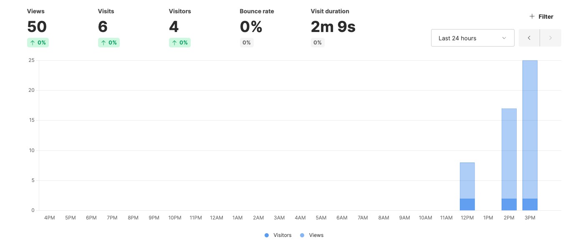
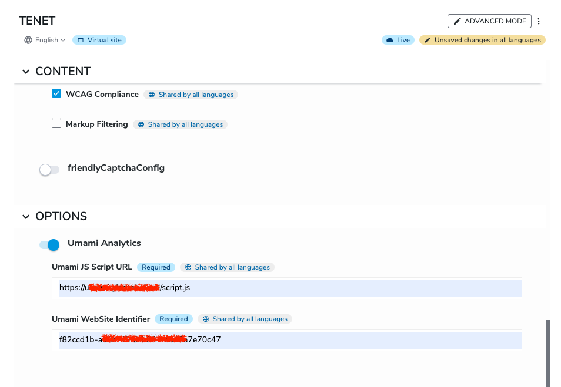

<a href="https://www.linkedin.com/company/gladtek">
    
</a>

Gladtek Umami Analytics for Jahia
======================
If you are searching for an alternative to Google Analytics and you are able to self-host an Open Source Alternative, you can try to install <a href="https://umami.is/">Umami</a>
It also comes with a paid subscription option.



To compile and deploy the project :

```bash
# compilation only
mvn clean install
# compilation and deployment on a server
mvn clean install jahia:deploy -PYourMvnJahiaProfile
# compilation and deployment on a local docker
mvn clean install jahia:deploy -Djahia.deploy.targetContainerName=MyJahiaDockerContainerName
```

Or you can Deploy the jar manually from Jahia Modules Administration

## Activate the module
- On your modules list, click on Gladtek Umami Analytics for Jahia
- Activate it on your site
- Go to your site settings
- Activate Umami Analytics and put the values of your Umami Configuration (Script URL and WebSite ID) 



## Visit your site in live mode
Once you visit some pages from your Jahia site you will see that the dashboard will start to bring new values about page visits.

In case you want further additional events to track, your components should use data-attributes in their html code
[Tracking Events](https://umami.is/docs/track-events)


> [!NOTE]  
>This is a basic implementation
>There are **more options** possible with Umami that can make this bundle upgradeable with **more variables** to use --> [Umami Docs](https://umami.is/docs).
